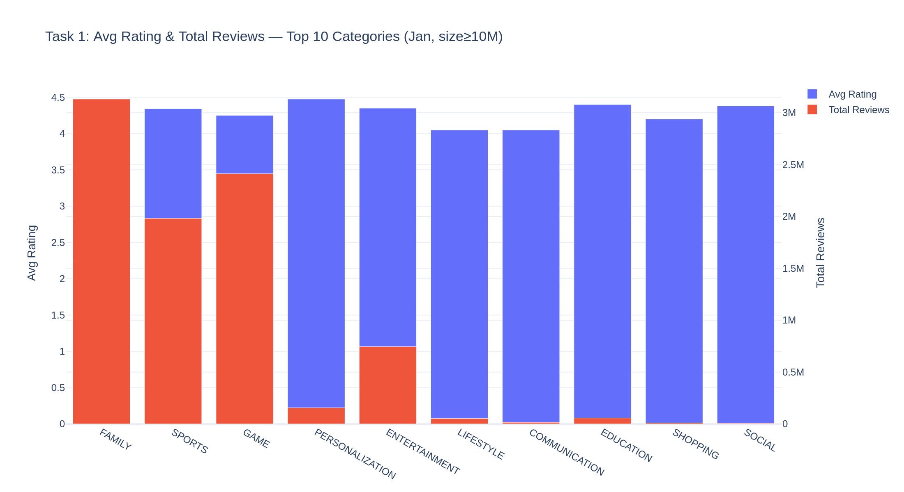
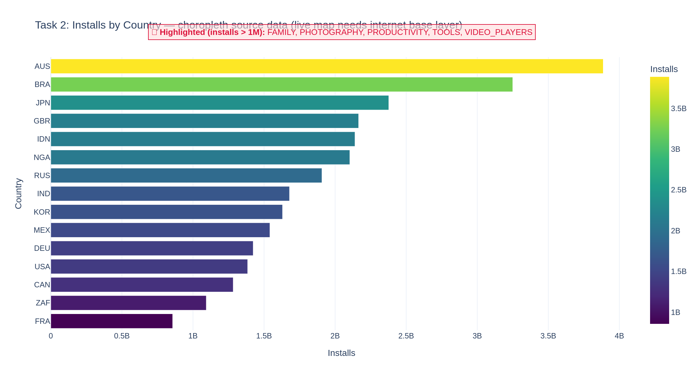
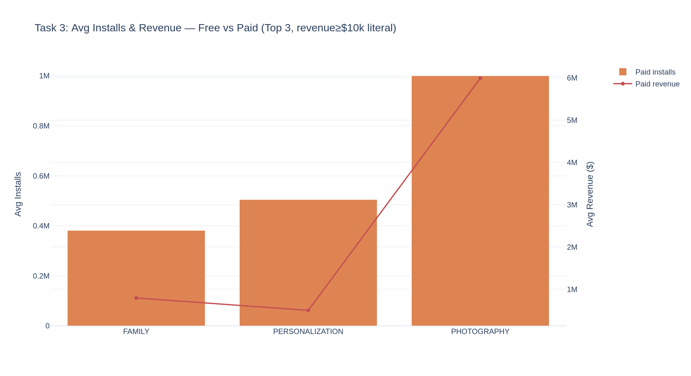
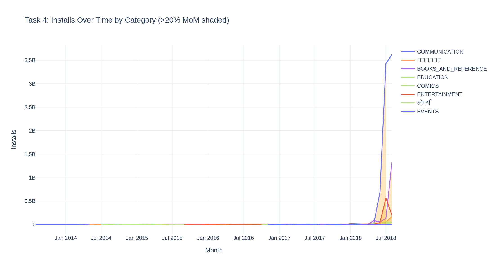
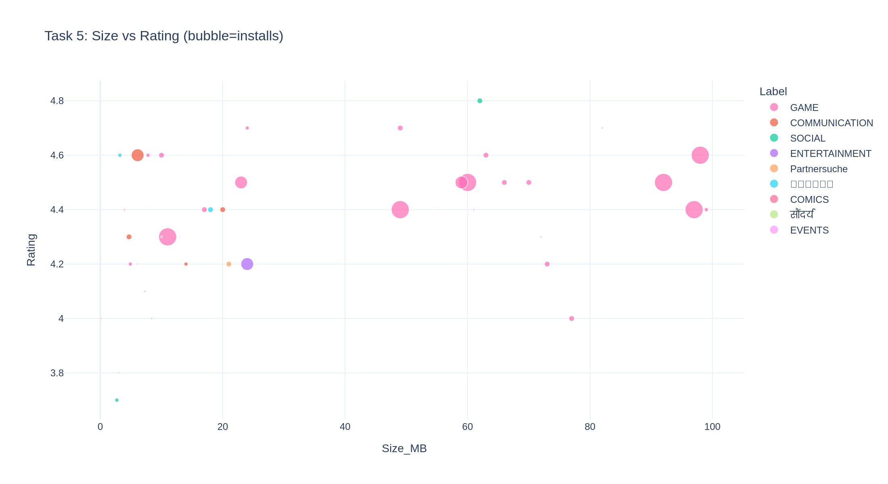
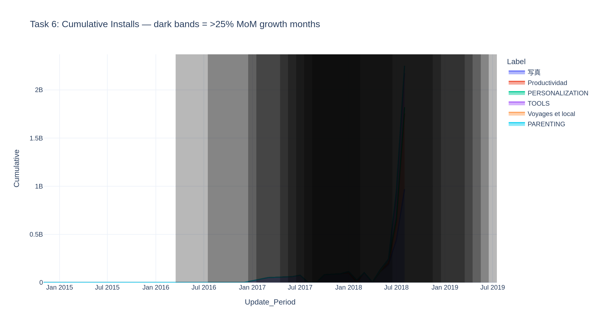

# 📱 Google Play Store Analytics Dashboard

An interactive analytics dashboard and notebook built on the Kaggle **Google Play Store Apps**
dataset, implementing six required visualizations with interactive slicers, category-name
translations, growth highlighting, and IST time-window gating.

> Extends the original training project (Google Play Store data analytics) — same dataset,
> additional dashboards and analytics features.

**🔴 Live demo:** https://playstore-analytics-dashboard-jmmw9aajsrqksisttp2pat.streamlit.app/

---

## 🚀 Live demo / hosting

**Streamlit Community Cloud (free):**
1. Push this folder to a public GitHub repo.
2. Go to <https://share.streamlit.io> → **New app** → select the repo → set the main file to `app.py`.
3. Upload `googleplaystore.csv` and `googleplaystore_user_reviews.csv` to the repo (or to the app's file storage).
4. Deploy → you get a public URL to share.

**Run locally:**
```bash
pip install -r requirements.txt
streamlit run app.py
```

---

## 📦 Dataset

Source: [Kaggle — Google Play Store Apps](https://www.kaggle.com/datasets/lava18/google-play-store-apps)

| File | Used for |
|------|----------|
| `googleplaystore.csv` | App metadata: category, rating, reviews, size, installs, price, content rating, last updated, Android version |
| `googleplaystore_user_reviews.csv` | `Sentiment_Subjectivity` (required by Task 5) |

Place both CSVs in the project root before running.

---

## 🧹 Transformations applied (`data_prep.py`)

| Field | Transformation |
|-------|----------------|
| `Installs` | Strip `+` and `,` → integer |
| `Price` | Strip `$` → float (free apps = 0) |
| `Size_MB` | `k`/`M`/`G` → MB; `"Varies with device"` → NaN |
| `Android_Min` | Parse leading numeric of "Android Ver" → float |
| `Last Updated` | Parse to datetime → `Update_Month`, `Update_Period` |
| `Revenue` | `Price × Installs` for paid apps (dataset has no revenue column) |
| `NameLen` | Character length of app name |
| Corrupt row | The known shifted "1.9" row is dropped |
| De-duplication | Keep the row with the most reviews per app |
| Sentiment | Mean `Sentiment_Subjectivity` per app merged from the reviews file |

---

## 📊 Visualizations & KPIs

The dashboard header shows global KPIs: **app count, category count, total installs, average rating**.
Each tab implements one task with the brief's filters. Every chart is **IST time-gated** —
visible only during its window unless the sidebar's *Ignore IST time windows* toggle is on.

| # | Chart | Key filters | IST window |
|---|-------|-------------|-----------|
| 1 | Grouped bar — avg rating & total reviews, top 10 categories by installs | Jan update · app size ≥ 10M · category avg rating ≥ 4.0 | 3–5 PM |
| 2 | Choropleth — global installs by country, top 5 categories | exclude A/C/G/S · >1M categories highlighted on-figure | 6–8 PM |
| 3 | Dual-axis — avg installs & revenue, free vs paid, top 3 categories | installs ≥ 10k · revenue ≥ $10k (literal, all apps) · Android > 4.0 · size > 15M · Everyone · name ≤ 30 chars | 1–2 PM |
| 4 | Time series — installs over time by category, shade >20% MoM | category E/C/B · name not x/y/z · no "S" · reviews > 500 · Beauty→Hindi, Business→Tamil, Dating→German | 6–9 PM |
| 5 | Bubble — size vs rating, bubble = installs | rating > 3.5 · 9 categories · reviews > 500 · no "S" · subjectivity > 0.5 · installs > 50k · Game in pink | 5–7 PM |
| 6 | Stacked area — cumulative installs by category | rating ≥ 4.2 · no digits in name · category T/P · reviews > 1000 · size 20–80MB · Travel→French, Productivity→Spanish, Photography→Japanese | 4–6 PM |

---

## 🖼️ Screenshots

| Task | Preview |
|------|---------|
| 1 — Grouped bar |  |
| 2 — Choropleth (source data) |  |
| 3 — Dual-axis |  |
| 4 — Time series |  |
| 5 — Bubble |  |
| 6 — Stacked area |  |

> Screenshots are generated from a **sample dataset** for illustration. Re-run the app/notebook on
> the real Kaggle CSVs for production figures.

---

## 🗒️ Documented interpretations

The brief contains requirements the raw dataset cannot satisfy literally. Decisions:

1. **Revenue** is computed as `Price × Installs` — there is no revenue column. In Task 3 the
   `revenue ≥ $10,000` filter is applied **literally to every app**, so free apps (revenue $0) are
   excluded and that chart typically shows paid apps.
2. **Choropleth country** — the dataset has no geography, so a deterministic synthetic country is
   assigned per app (seeded hash) purely so the map renders. Clearly a demo mapping, not real geography.
   Categories exceeding 1M installs are highlighted in a red callout on the figure. The live map
   fetches its base layer from a CDN, so it needs an internet connection; the included screenshot
   shows the underlying installs-by-country data with the same highlight.
3. **Time-window gating** is enforced in code; set the sidebar toggle (or `SHOW_OVERRIDE` in the
   notebook) to preview all charts regardless of time.
4. **Static-export fonts** — some translated labels (e.g. Tamil) may show as boxes in exported PNGs
   if the server lacks the font; they render correctly in the live browser dashboard.

---

## 📁 Project structure

```
playstore-analytics-dashboard/
├── app.py                            # Streamlit interactive dashboard
├── data_prep.py                      # Shared loading & cleaning
├── Google_Playstore_Analytics.ipynb  # Notebook with all 6 charts
├── requirements.txt
├── README.md
├── task1_grouped_bar.png … task6_stacked_area.png   # chart previews
├── googleplaystore.csv
└── googleplaystore_user_reviews.csv
```

---

## 🛠️ Tech stack

Python · pandas · NumPy · Plotly · Streamlit · Jupyter
